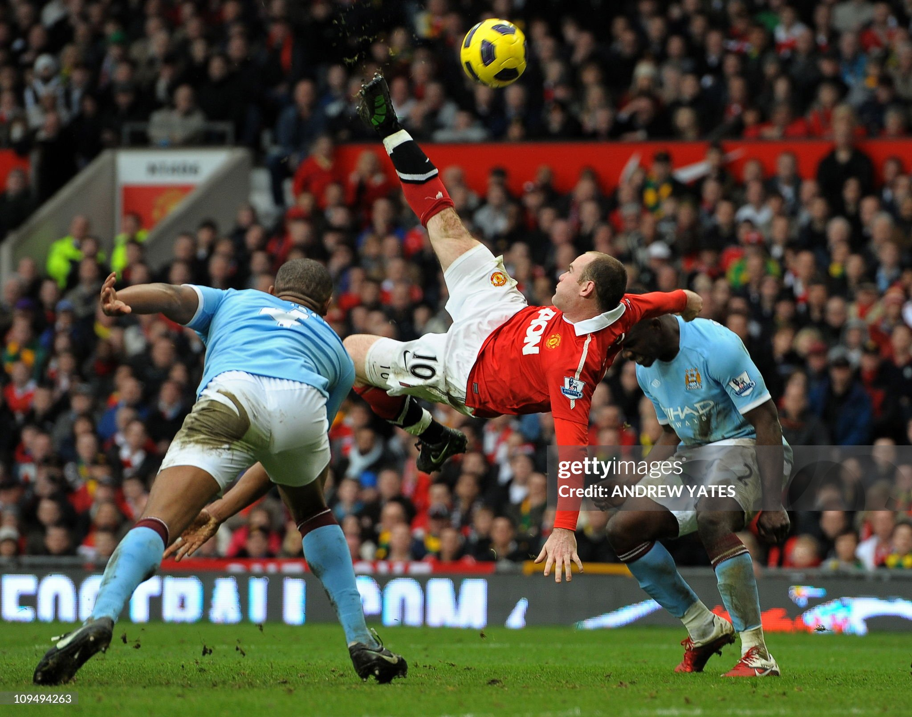
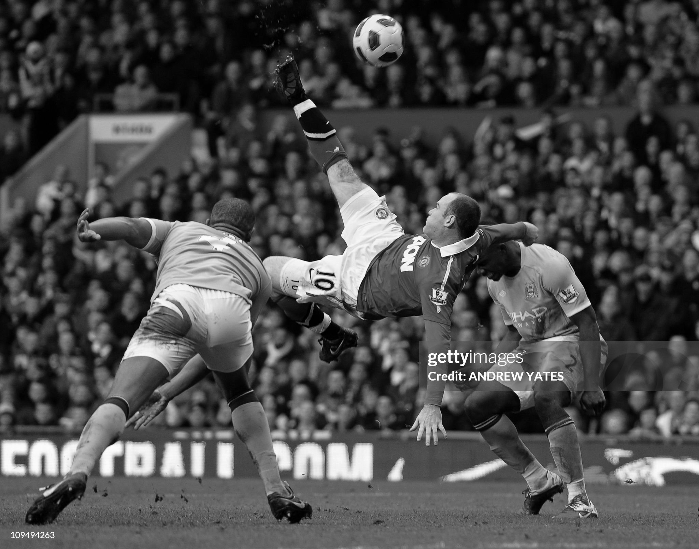

### Cuda Matrix Multiplication

#### Setup
```
mkdir build
cd build
cmake ..
make
./rgb2gray <input-image-path> <output-image-path>
./img_blur <input-image-path> <output-image-path> <kernel-size>
```
As the image blur implementation uses constant memory, the maximum permissible kernel-size is set to 15. However, this can be increased as constant memory can hold upto 64Kbs. The kernel size defaults to 3x3.

#### Grayscale samples
 


#### Blurring samples

Kernelsize = 7

 
 
