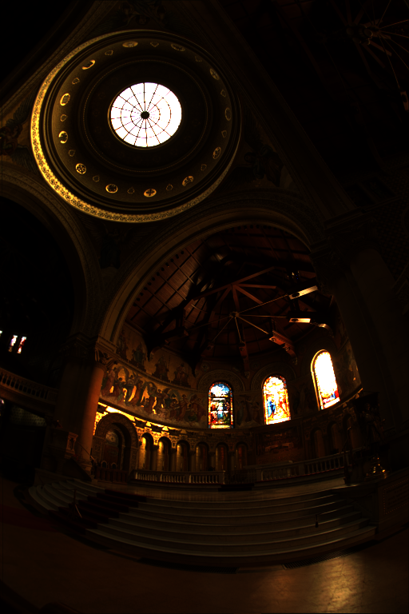
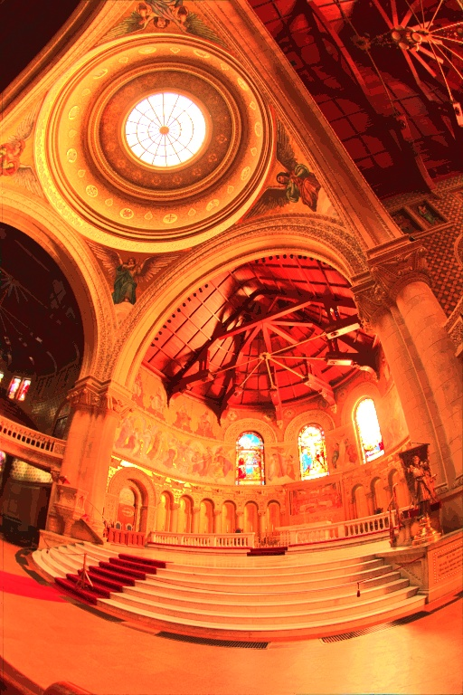

### Cuda Tone Mapping
A simple cuda program to apply tone mapping on images by performing histogram equalization on the luminance channel.

#### Steps
1. Read HD Image
2. Convert RGB to YUV
3. Compute cdf-histogram of Y channel
4. Equalize Y channel
5. Convert new YUV back to RGB
#### Setup
```
mkdir build
cd build
cmake ..
make
./tonemap <input-image-path> <output-image-path>
```

#### Tonemapping sample
 

